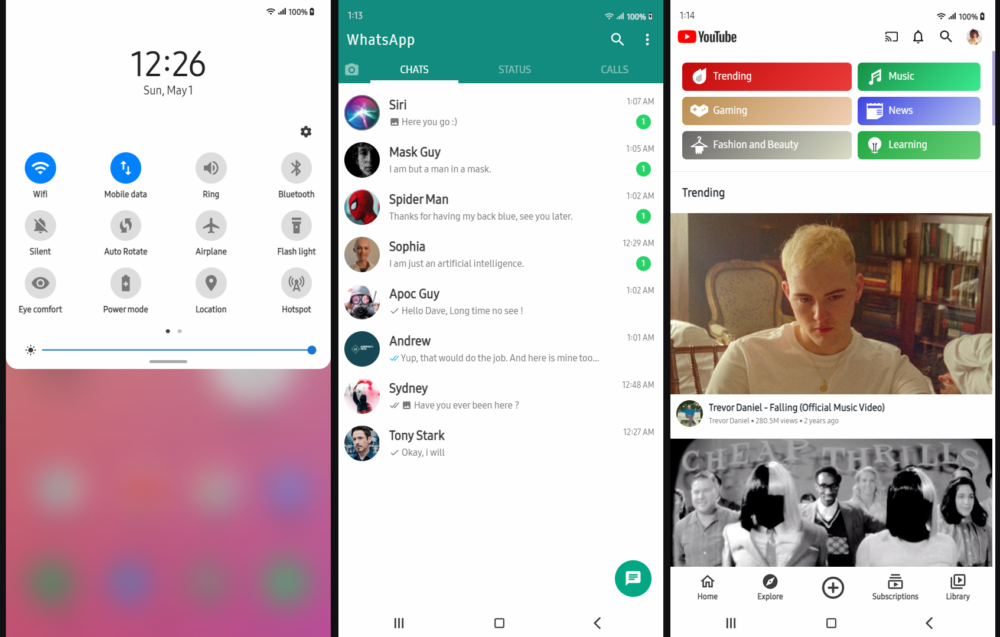

# Android on Web

An open-source project that aims to provide an indistinguishably accurate experience of Android on web. The project leverages different JavaScript Web APIs to imitates the Android functionalities and CSS animations to bring life into it.

------------
#### Visit the Live Application🌈: &nbsp; [android.blueedge.me](https://android.blueedge.me)

## Gallery

#### Visit the Live Application🌈: &nbsp; [android.blueedge.me](https://android.blueedge.me)

# Stack

- Framework - React (^17.0.2) + Redux
- Component/UI Library - Material UI
- Styling Solution - SCSS and CSS Modules (+ tailwind).
- Icons - fontAwesome/mui icons/custom svg icons

# Features
- [x] Home page, App icons
- [x] Bottom Navigation bar
- [x] Widgets like google search
- [x] Calendar, Date, Clock Widgets
- [x] Quick menu from slide up
- [x] Recent menu and apps
- [x] WhatsApp Application
- [x] YouTube Application
- [x] Google Search App

# Dev Features
- [x] Flexible and Scalable
- [x] Easy to add custom Applications
- [x] Easy to bind with existing system
- [x] Built-In Navigation system per app
- [x] Modular Applications and their styling
- [x] Proper state management with Redux

## FAQ

1. Is this real android OS?
    - No, This is not a real operating system. It is just imitation of it with different technology.

2. How long did it take?
    - 6 weeks (without gaps)

3. Have you ran into problems during development?
    - Duhh. More than dozen big ones and hundreds of small problems ([more info](timeline.md)).

4. Can I contribute?
    - Yes, you can! Open an issue, create a pull request, head over to [discussions](https://github.com/blueedgetechno/androidInReact/discussions) or join the [discord](https://discord.gg/NcjaNdwtnR).

5. Where did you get the inspiration from, if you have?
    - I got the inspired to make the project on the suggestion of [Derry Shribman](https://github.com/xderry).

6. Why do JavaScript developers wear glasses?
    - Because they cannot C# (see sharp). &nbsp;&nbsp;&nbsp; 

## Online Deployment

## Acknowledgements

- [Derry Shribman](https://github.com/xderry)
- [React-hammerjs](https://github.com/JedWatson/react-hammerjs)
- [React-slick](https://github.com/akiran/react-slick)

## Contributors

## License

⚖️ CC0-1.0 License
